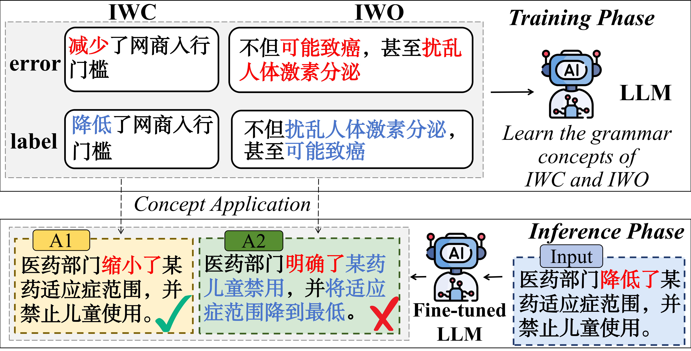
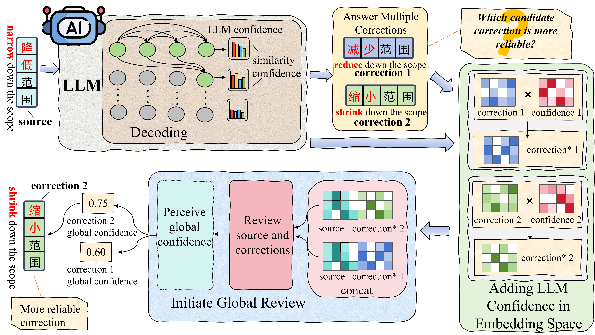

<p align="center" >
    <a href="https://github.com/TLL1213/ExIT-main">
    <br>
    
    <br>
    </a>
</p>
<p align="center">
    <a href="https://github.com/xlxwalex/FCGEC/blob/main/LICENSE">
        
    </a>
</p>

---
# Intuitive Thinking: Expanding Large Language Models’ Thinking for Rapid Decision-Making on Candidate Corrections in Chinese Grammar Error Correction

论文链接：https://ojs.aaai.org/index.php/AAAI/article/view/40503

## ExIT介绍
中文语法错误纠正（Chinese Grammatical Error Correction，CGEC）旨在识别并纠正句子中的语法错误。
CGEC任务不仅可以作为语言学习、自动语音识别、文本数据标注等任务的前置任务，而且还可以服务于教育、媒体和出版等行业。

<div align="center">
<figure align="center">
  
  <figcaption>图1 概念混淆示例</figcaption>
</figure>
</div>

  
LLM在训练阶段会学习到不同的语法概念，而纠正错误时可能出现概念混淆(concept confusion)问题。如图1所示，LLM无法区分学习到的IWO和IWC这两个语法概念，导致对同一个错误句子，给出了和这两个语法概念对应的两种纠正。由于思维方式的限制，LLM可以同时给出不同的纠正，但无法回顾以确定哪一个纠正更可靠。


当出现概念混淆时，LLMs与人类一致，会给出不同的纠正。但人类拥有一种直觉思维（Intuitive Thinking）模式，人类会根据经验和直觉从中选择更可靠的选择，这是一个快速的决策过程，时间受限的场景下尤为重要。受到人类这种直觉思维模式的启发，我们旨在拓展LLM的思维过程，以缓解概念混淆带来的不稳定性，释放纠错性能。


## ExIT模型
<div align="center">
<figure align="center">
  
  <figcaption>图2 ExIT模型</figcaption>
</figure>
</div>

  
为了拓展LLM的思维方式，达到缓解概念混淆问题的目的，我们提出了Expanding Intuitive Thinking Model（ExIT）。LLM不确定使用哪种语法概念去纠正错误句子时，会给出尽可能多的不同纠正。除此之外，LLM依据学习到的先验知识还会给出纠错的置信度（confidence）信息。ExIT依托轻量化架构，融合LLM纠错的置信度信息，快速决策不同纠正中更可靠的一个纠正作为最终结果。在这个过程中，ExIT对比了原始句子与纠正之间的关联性。与LLM仅基于前置token进行局部思考的方式不同，ExIT的这种全局性思考更符合人类检查自己作答答案的过程。


该方法的设计初衷是在尽可能保留LLM预训练阶段所获得能力的基础上，利用前置模型的推理信息（不仅仅局限于自然语言结果）作为先验信息，对LLM进行结构扩展，从而实现思维能力的进一步拓展。
ExIT模型支持批处理，具有轻量化的特点。在无需引入额外预训练模型的前提下，能够有效承接LLM输出的置信度信息，实现对模型直觉推理能力的扩展。这一过程并非割裂地组合两个模型，ExIT是LLM的拓展。


## 数据集使用说明
本研究使用三种母语者数据集 [FCGEC](https://github.com/xlxwalex/FCGEC/tree/main) 、 [NaCGEC](https://github.com/masr2000/NaCGEC) 、 [NaSGEC-exam](https://github.com/HillZhang1999/NaSGEC) 进行验证。  
其中对于FCGEC数据集原作者提供了将数据集转换为Seq2Seq格式的代码。可以去到原作者处下载相应数据集。

## 训练脚本使用说明
### 1.LLM训练数据构建
**通过K-折交叉推理获得训练数据**  

- 首先获得K个数据集。
  - 通过脚本`data/data_segment.py`获得K个子集，通过在K-1个子集训练的LLM去推理剩下的子集
- 除了训练上述所说K个模型以外，还需要训练一个包含完整数据的模型，用于最终推理

### 2.模型训练
预先对模型进行有监督微调，本文使用ms-swift开源框架进行微调。
微调格式示例如下：
```python
{"messages": [{"role": "system", "content": "你是一个有用的中文文本修正助手，你可以纠正中文句子中存在的错误。"}, {"role": "user", "content": "由于加强了生产过程中的生态环境监控，该基地每年的无公害蔬菜的生产量除供应本省主要市场外，还销往河南、河北等省。"}, {"role": "assistant", "content": "由于加强了生产过程中的生态环境监控，该基地每年生产的无公害蔬菜除供应本省主要市场外，还销往河南、河北等省。"}]}
```

总共需要训练K+1个模型，分别是K个子集训练的模型和完整数据训练的模型。
- 所有LLM的训练均使用ms-swift框架进行训练，采样LoRA微调方法。


### 3.EXIT模型的训练数据构建
**获得不同子模型的推理数据**  
- 通过脚本`gain_fcgec_train_data_segment.py`获得用于训练ExIT模型的不同数据集子集
  - 这里部署的模型需要在K-1份数据上训练的LLM
- 通过脚本`gain_sampling_data.py`获得验证集和测试集的推理结果
  - 这里的模型需要在完整训练集上训练的LLM
- 通过脚本`gain_fcgec_train_data_merge_segment.py`合并不同子模型的推理结果得到训练ExIT的数据  
- 通过脚本`sampling_data_add_token_id.py`补全不同token在相应词表中对应的token_id  
  - 只有验证集和测试集需要
  - 脚本`sampling_data_add_token_id_glm4.py`是针对GLM4模型写的脚本，这与Qwen模型不一致，执行完`sampling_data_add_token_id_glm4.py`可以通过脚本`data/Glm4toQwen2.5.py`转换token表示
- 通过脚本`sampling_data_id_add_label.py`获得训练EXIT模型数据的label  
  - 仅仅只有验证集需要进行这一步，训练集在脚本`gain_fcgec_train_data_merge_segment.py`时就一并计算了
- 通过脚本`sampling_data_label2train_score.py`转换数据格式为ExIT所需的训练格式


### 4.EXIT模型的训练
**训练脚本**  
通过脚本`train.py`训练ExIT模型


### 5.ExIT模型的推理
通过脚本`predict.py`进行批处理推理  
推理后的json文件可以通过脚本`json_2CHERRANT.py`转换为可验证性能的格式，性能计算方法见“6.性能验证”

### 6.性能验证
对于纠错任务，我们使用字符级编辑指标，这是 [MuCGEC](https://github.com/HillZhang1999/MuCGEC) 中提出的衡量纠错性能的指标，更详情可以参考他们的论文。
详细信息可以查看 [FCGEC](https://github.com/xlxwalex/FCGEC/tree/main) 的scorer中的评分设置。

## 引用
如果您使用了我们的模型或者认为我们的工作对您有帮助，您可以引用我们的论文：
***Intuitive Thinking: Expanding Large Language Models’ Thinking for Rapid Decision-Making on Candidate Corrections in Chinese Grammar Error Correction***
```
@inproceedings{long2026intuitive,
  title={Intuitive Thinking: Expanding Large Language Models’ Thinking for Rapid Decision-Making on Candidate Corrections in Chinese Grammar Error Correction},
  author={Long, Lintao and Huang, Ruizhang and Bai, Ruina and Qin, Yongbin and Fu, Qihang},
  booktitle={Proceedings of the AAAI Conference on Artificial Intelligence},
  volume={40},
  number={38},
  pages={32293--32301},
  year={2026}
}
```


